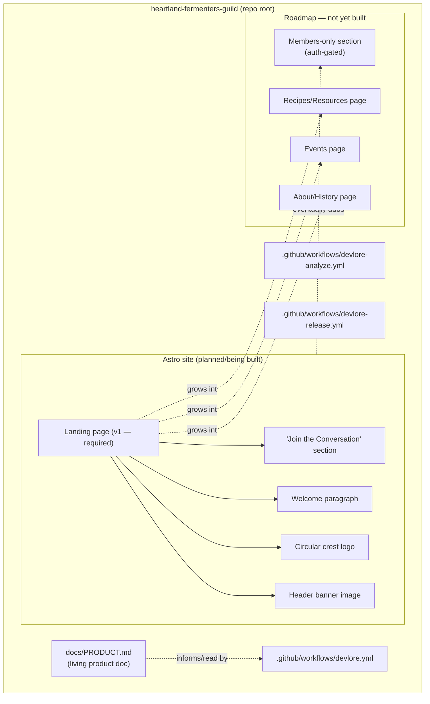
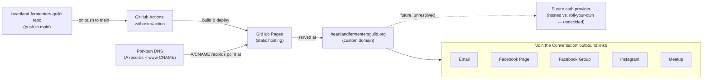

<!-- devlore:visualizer source-hash:926d22579dfb7a99c819f13b5bf0df1576d380720acb271f7695e7092a5fb207 -->
> **Do not move, rename, or edit this file.** Devlore generates and maintains this diagram automatically from `docs/PRODUCT.md`'s requirements — manual edits will be overwritten the next time Devlore detects the requirements have changed. To change what's diagrammed, update `docs/PRODUCT.md` itself.

The codebase snapshot contains no actual application source code — only three Devlore-related GitHub Actions workflow files and the placeholder `docs/PRODUCT.md`. The diagrams below are therefore my best-effort reconstruction based on the product doc's stated requirements and roadmap, not on observed code, and I've marked not-yet-built pieces as planned/future.

Caption: Internal structure of the repo as described — current scaffold (Devlore workflows, product doc) plus the Astro site content the requirements specify, distinguishing what's built (v1 landing page) from what's only planned (info pages, members-only section).

Caption: External services and destinations the site depends on or links out to — the build/hosting/DNS chain that gets the site live, and the social platforms the "Join the Conversation" section points to.

No separate "other linked repos" diagram is included: the docs mention Devlore as a tool/service integration and Porkbun/GitHub Pages as external infrastructure, but no other actual sibling repository or project connection is described.
