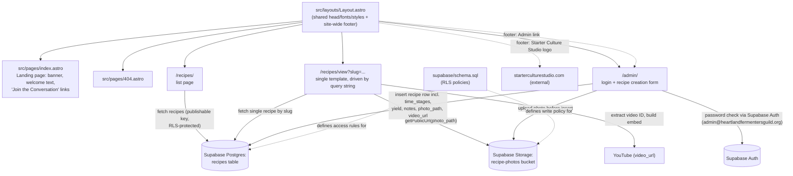
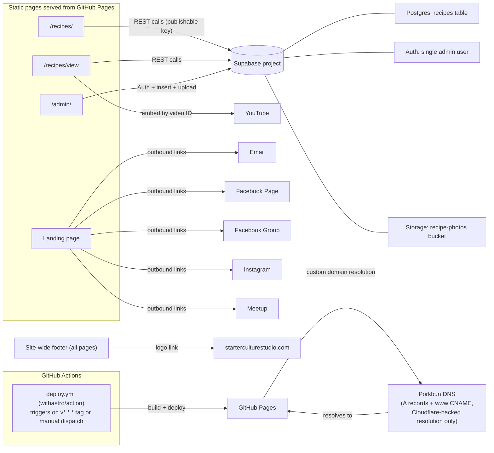
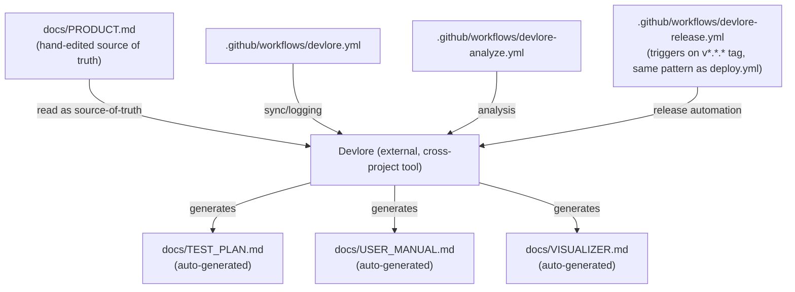

<!-- devlore:visualizer source-hash:59f165593a70a9e1188fcd4ca6188c253e6bf1d8dac39c806f28c8c5075098bc -->
> **Do not move, rename, or edit this file.** Devlore generates and maintains this diagram automatically from `docs/PRODUCT.md`'s requirements — manual edits will be overwritten the next time Devlore detects the requirements have changed. To change what's diagrammed, update `docs/PRODUCT.md` itself.

Since PRODUCT.md describes the recipes/admin database-backed section in the present tense (Requirements #7–13) even though the codebase snapshot text predates it, I've grounded the internal-structure and external-dependency diagrams in what PRODUCT.md describes as shipped, while noting via the snapshot which pieces (Layout, index, 404) are independently confirmed on disk.

This first diagram shows how the site's own pages and the shared layout relate, including the client-side calls the recipes and admin pages make out to Supabase (no server code runs in this repo itself — GitHub Pages can't run it).

This second diagram shows the outside services and third-party destinations the static site talks to at runtime or deploy time — everything here is called directly from the browser or from CI, since there's no backend server in this project.

This third diagram shows the repo's real, documented connection to Devlore, the separate cross-project documentation tool this project's own docs are generated for/by — omitting anything about Starter Culture Studio or other outbound links since those are just outbound URLs, not linked repos/projects.

