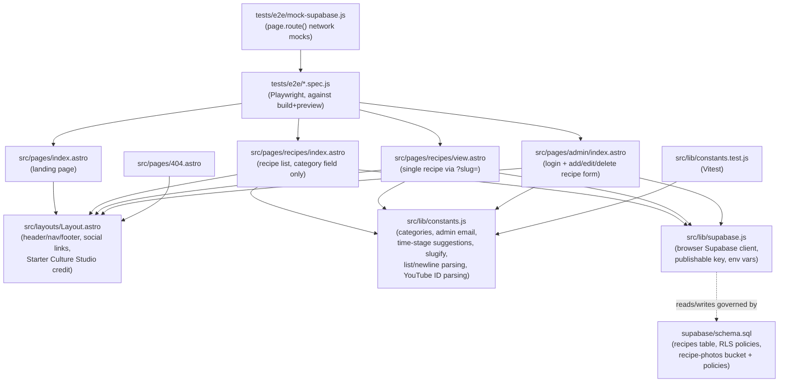
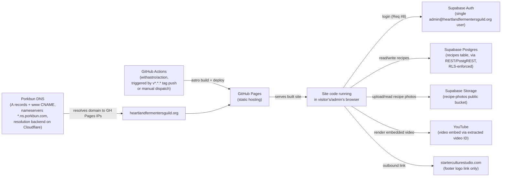
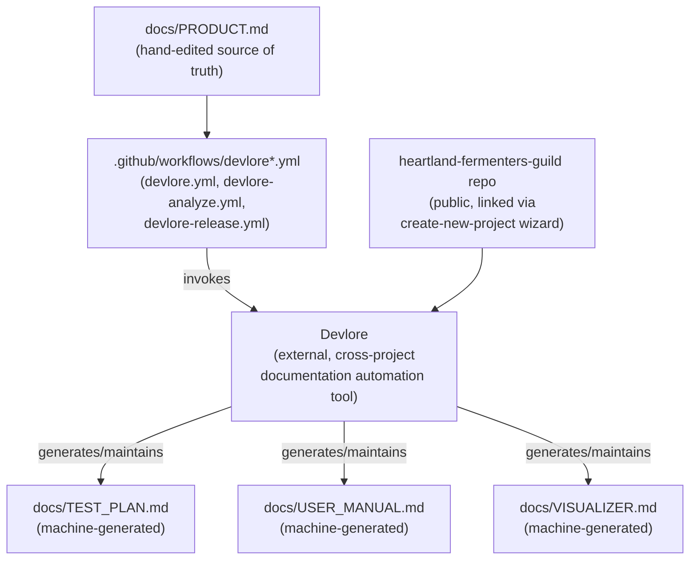

<!-- devlore:visualizer source-hash:3458f76c4608c85a10ca53ca5f52612dedb61408879b777a49ad71c827f49fb7 -->
> **Do not move, rename, or edit this file.** Devlore generates and maintains this diagram automatically from `docs/PRODUCT.md`'s requirements — manual edits will be overwritten the next time Devlore detects the requirements have changed. To change what's diagrammed, update `docs/PRODUCT.md` itself.

Since a codebase snapshot is provided, the diagrams below reflect the actual file/module layout described (pages, layout, lib modules, tests) alongside the external services and tooling connections named in the docs.

This diagram shows how the Astro pages, shared layout, and the two `src/lib` modules relate to each other inside the repo, plus how the test suites target each layer.

This diagram shows the outside services the live site talks to directly from the browser (no backend server of its own), plus the deploy/DNS chain that gets it onto the internet.

The docs describe one real cross-repo connection — this project links to the external Devlore documentation tool via its workflows — so that's shown here rather than speculating about any other linked project.

