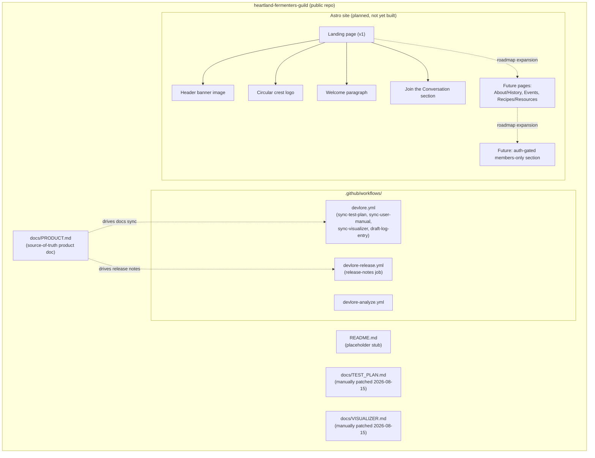
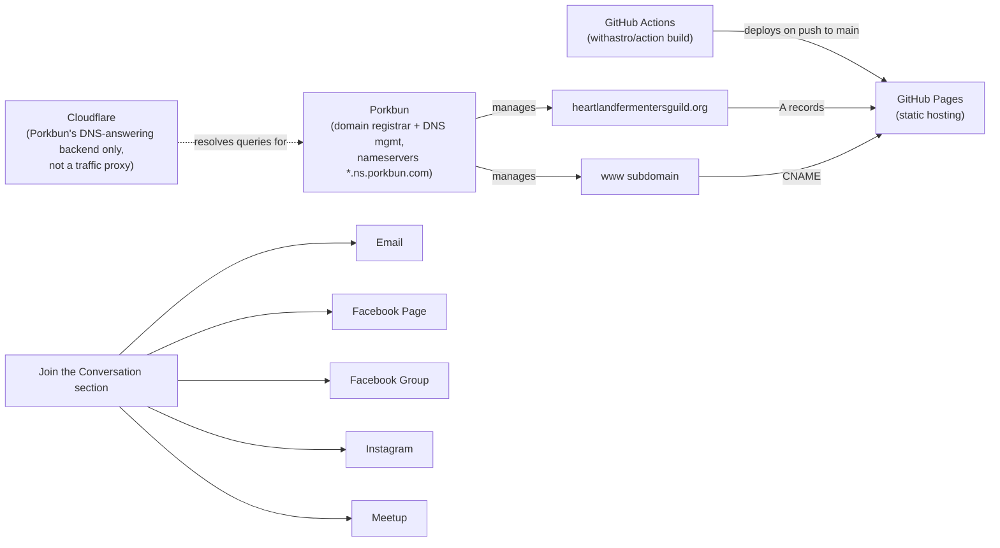
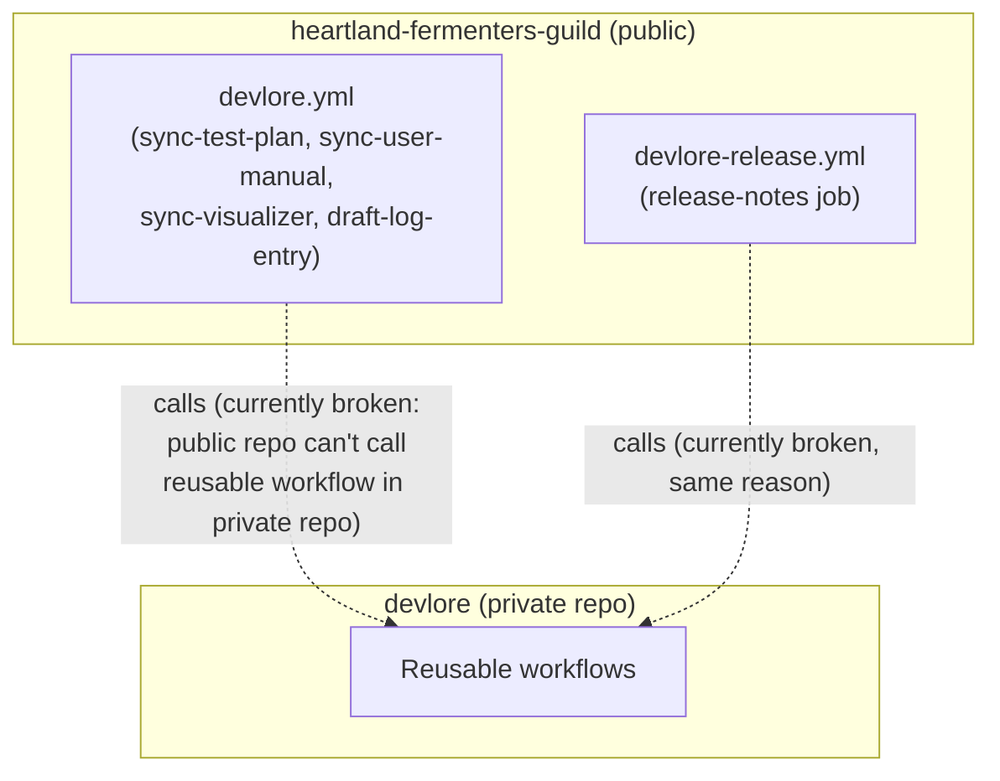

<!-- devlore:visualizer source-hash:195a9cdbd632ce91774abfc81be0b88c222d9eb40bfacdaaf82e528ad6731343 -->
> **Do not move, rename, or edit this file.** Devlore generates and maintains this diagram automatically from `docs/PRODUCT.md`'s requirements — manual edits will be overwritten the next time Devlore detects the requirements have changed. To change what's diagrammed, update `docs/PRODUCT.md` itself.

The codebase snapshot shows only a fresh scaffold (three GitHub Actions workflow files, a placeholder README, and the templated `docs/PRODUCT.md`) — no Astro source, pages, or components exist yet. The diagrams below are therefore drawn from what the product doc describes as built/decided (the workflow files, the planned landing-page content, and the hosting/DNS setup), not from actual application code.

Internal structure — the repo's current files plus the planned v1 landing-page content and roadmap pages described in the requirements (nothing here is implemented in code yet, only specified):

External dependencies — the hosting, DNS, and outbound social links the site relies on, as described in the requirements:

Other linked repos/projects — the documented (currently broken) connection between this repo's workflows and the private `devlore` repo's reusable workflows:

