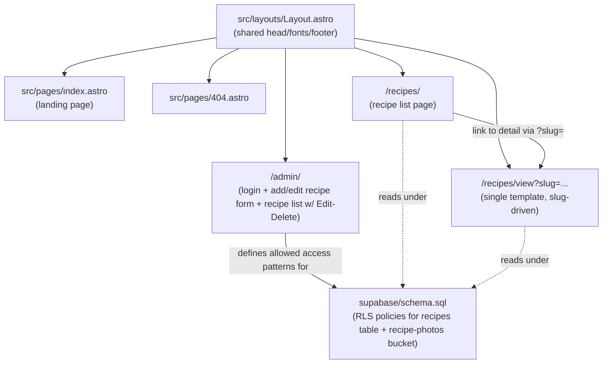
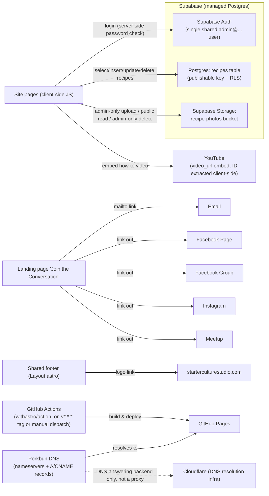
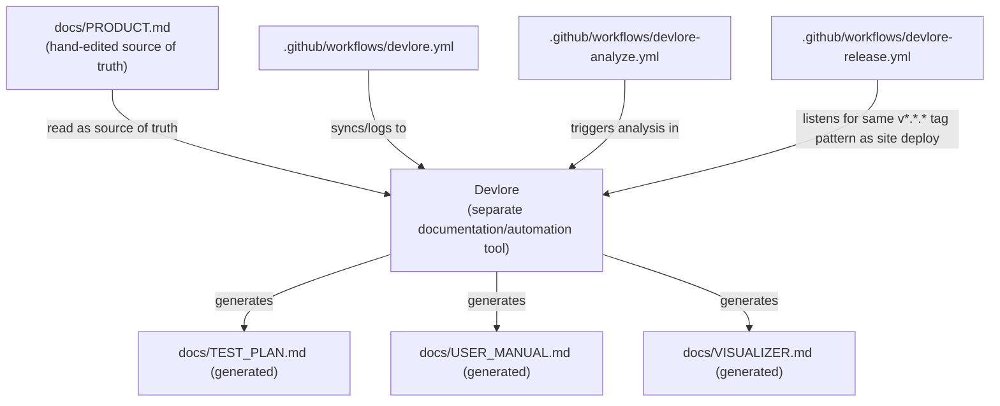

<!-- devlore:visualizer source-hash:b0a4293e3476ff1d2cd052d851cf191ff34e61ac08105d967f201fe544c46ffd -->
> **Do not move, rename, or edit this file.** Devlore generates and maintains this diagram automatically from `docs/PRODUCT.md`'s requirements — manual edits will be overwritten the next time Devlore detects the requirements have changed. To change what's diagrammed, update `docs/PRODUCT.md` itself.

Two caveats before the diagrams: the codebase snapshot only shows the pre-recipes landing-page skeleton (`Layout.astro`, `index.astro`, `404.astro`, deploy/Devlore workflows) — the recipes/admin/Supabase pieces from PRODUCT.md Requirements #7–14 aren't reflected in any file listing I have, so the internal-structure diagram below is reconstructed from PRODUCT.md's description of routes and behavior, not from verified source files.

This first diagram shows how the site's own pages relate: the shared layout wrapping every page, the static landing page, and the recipes/admin pages that PRODUCT.md describes as browser-driven Supabase clients.

This second diagram shows the outside services and destinations the site talks to directly from the browser (no backend of its own), plus the deploy and DNS chain.

This third diagram covers the one other real cross-project connection described in the docs: the Devlore tooling that reads this repo's `docs/PRODUCT.md` and drives its own generated docs and release workflow.

