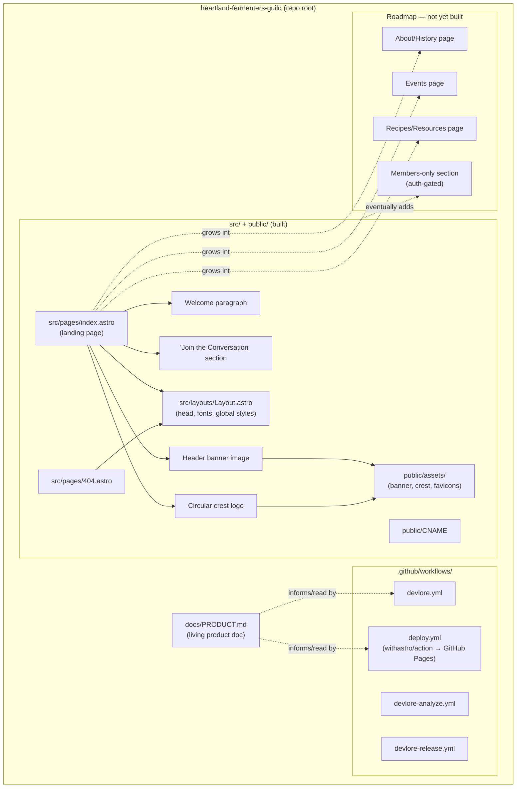
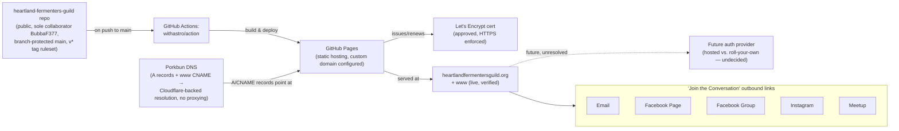

<!-- devlore:visualizer source-hash:926d22579dfb7a99c819f13b5bf0df1576d380720acb271f7695e7092a5fb207 -->
> **Do not move, rename, or edit this file.** Devlore generates and maintains this diagram automatically from `docs/PRODUCT.md`'s requirements — manual edits will be overwritten the next time Devlore detects the requirements have changed. To change what's diagrammed, update `docs/PRODUCT.md` itself.

> **Note:** This file was updated manually, not by Devlore's automation, because `devlore.yml`'s `sync-visualizer` job currently fails — this repo is public and its reusable workflow lives in the private `devlore` repo, which GitHub disallows. See `docs/PRODUCT.md` requirement 4 and `docs/TEST_PLAN.md`'s Out of scope section. Devlore will resync (and may overwrite this) once that's resolved.

The repo now contains a working Astro static site (v1 landing page, built and deployed), not just the Devlore scaffold. The diagrams below reflect the actual current structure, distinguishing what's built from what's only planned.

Caption: Internal structure of the repo — the built Astro site, its content sections, the CI/deploy and Devlore workflows, and what's still roadmap-only.

Caption: External services and destinations the site depends on or links out to — the build/hosting/DNS chain that gets the site live (now verified working end-to-end), and the social platforms the "Join the Conversation" section points to.

No separate "other linked repos" diagram is included: the docs mention Devlore as a tool/service integration (currently unable to sync docs back to this repo — see note above) and Porkbun/GitHub Pages as external infrastructure, but no other actual sibling repository or project connection is described.
