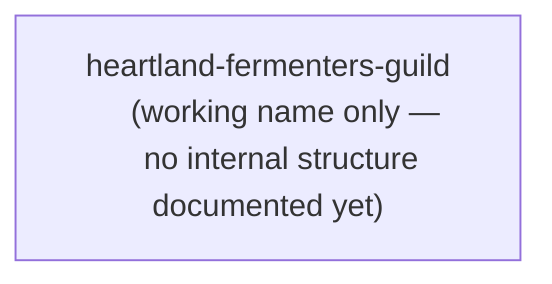

<!-- devlore:visualizer source-hash:e1b5a85745c03487306da36e42e77b5af24668f1f4d6ed481835c67db6b09d06 -->
> **Do not move, rename, or edit this file.** Devlore generates and maintains this diagram automatically from `docs/PRODUCT.md`'s requirements — manual edits will be overwritten the next time Devlore detects the requirements have changed. To change what's diagrammed, update `docs/PRODUCT.md` itself.

No codebase snapshot exists yet for this project, and the master docs are empty. The product doc itself is still a blank template — the vision, requirements, and open questions sections have not been filled in, and even the one-line description of the project hasn't been written. This means there is no evidence of any actual modules, files, APIs, external services, or linked repos to diagram. Inventing structure here would violate the grounding requirement, so below is the most honest "best effort" possible: a single placeholder diagram showing the project as an undefined whole, with nothing further to decompose.

Internal structure: no components, modules, or relationships have been documented anywhere, so the project can only be shown as a single unresolved unit pending discovery.

External dependencies: not shown as a diagram — the docs contain no mention of any outside APIs, services, or integrations, so there is nothing evidenced to depict.

Linked repos/projects: omitted entirely, per instructions, since no connection to any other repo or project is described anywhere in the available material.

Once `docs/PRODUCT.md` has a filled-in vision/requirements section and/or a codebase snapshot has been generated, these diagrams can be redrawn with real content.
