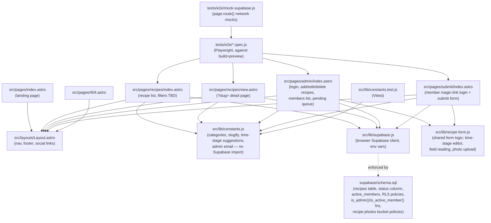
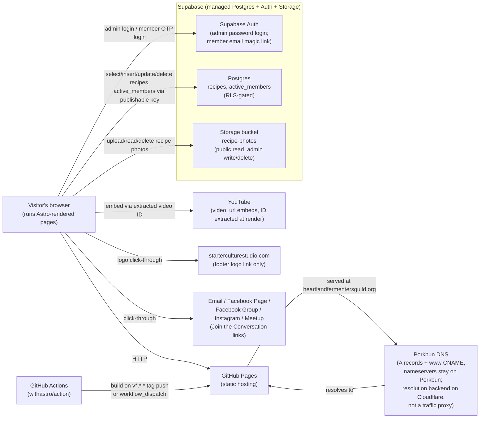
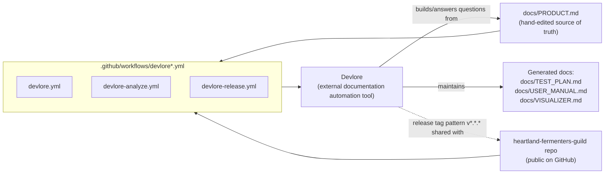

<!-- devlore:visualizer source-hash:980aed6e57a22c09431b1187fc6942e3ee95d23d1a284da6d7a1771e592cd3d0 -->
> **Do not move, rename, or edit this file.** Devlore generates and maintains this diagram automatically from `docs/PRODUCT.md`'s requirements — manual edits will be overwritten the next time Devlore detects the requirements have changed. To change what's diagrammed, update `docs/PRODUCT.md` itself.

Since a codebase snapshot is included, these diagrams are grounded in both the snapshot and `PRODUCT.md`.

This diagram shows how the site's own Astro pages, shared layout, and `src/lib` helper modules relate to each other, plus the schema file that defines the database shape they talk to.

This diagram shows the outside services and third-party destinations the site talks to at runtime and at deploy time — there's no backend of its own, so the browser calls Supabase directly.

This diagram shows Devlore, the one external, cross-project tool with a real described connection to this repo — it isn't part of the shipped site, but it reads and generates project docs via dedicated workflows.

