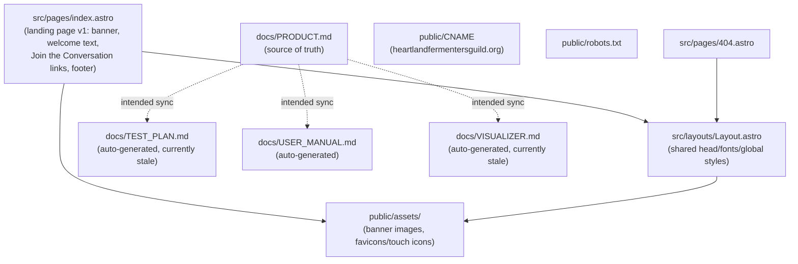
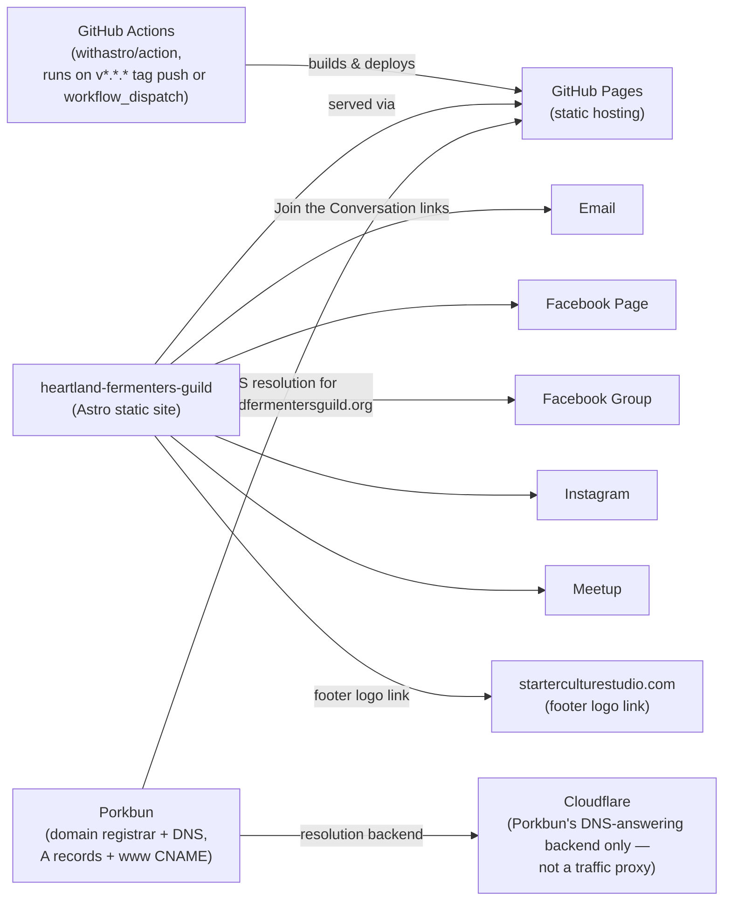
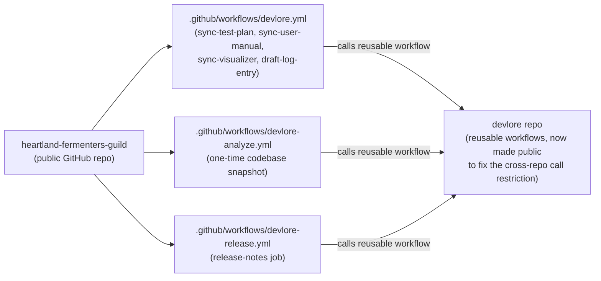

<!-- devlore:visualizer source-hash:57af53d0b2b114a61a641e107efd365064cd9d52da2d6a6d50e2c1d140d82f61 -->
> **Do not move, rename, or edit this file.** Devlore generates and maintains this diagram automatically from `docs/PRODUCT.md`'s requirements — manual edits will be overwritten the next time Devlore detects the requirements have changed. To change what's diagrammed, update `docs/PRODUCT.md` itself.

Below are diagrams grounded in the file tree, `PRODUCT.md`, and the baseline codebase snapshot.

**1. Internal structure** — how the Astro site's own pages/layout/assets and Devlore-support docs relate within the repo.

**2. External dependencies** — the outside services the built site and its deploy pipeline actually rely on.

**3. Linked repos/projects** — the documented connection to the separate Devlore tool and its private repo of reusable workflows.

