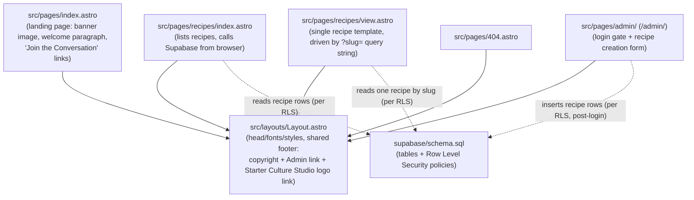
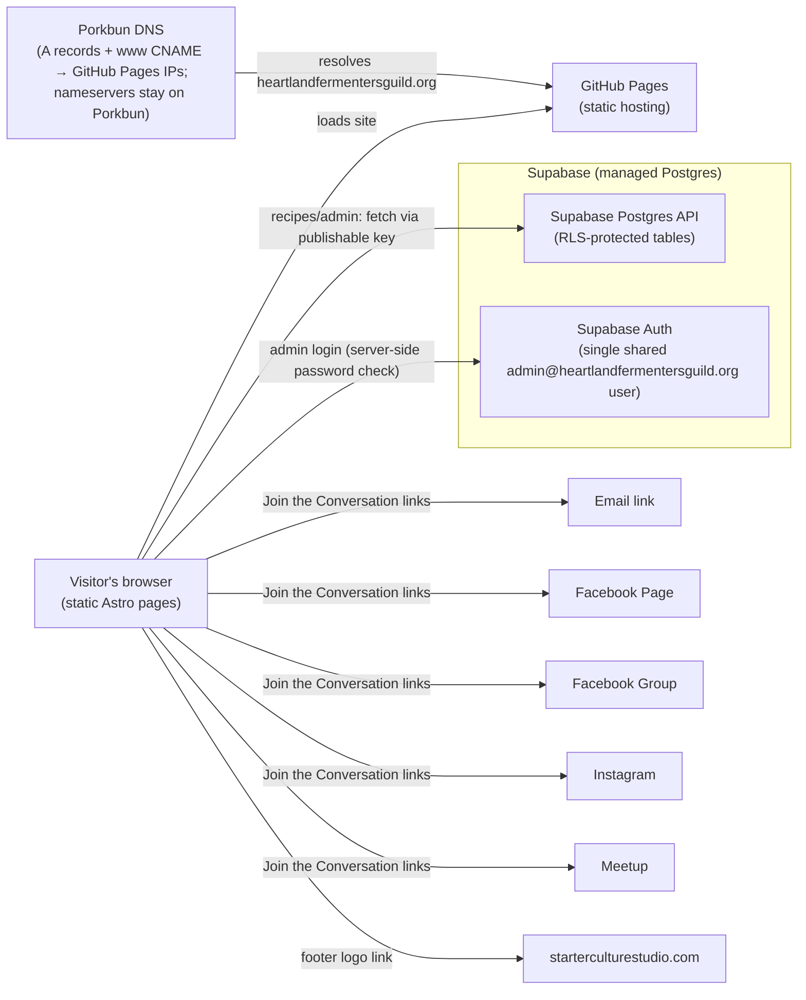
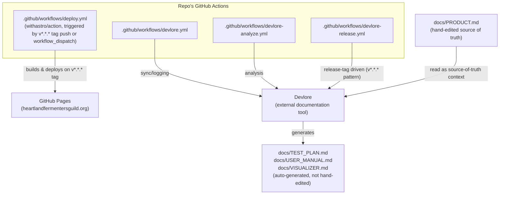

<!-- devlore:visualizer source-hash:5633442e5406f0981136f58b9ad83fda94cc061088ed6f6d6fe3d8bc2002e921 -->
> **Do not move, rename, or edit this file.** Devlore generates and maintains this diagram automatically from `docs/PRODUCT.md`'s requirements — manual edits will be overwritten the next time Devlore detects the requirements have changed. To change what's diagrammed, update `docs/PRODUCT.md` itself.

Internal structure: how the Astro pages, the shared layout, and the Supabase schema file relate to each other within the repo.

External dependencies: the outside services the static site talks to directly from the browser, plus the DNS/hosting chain that makes the domain work.

Other linked project: the repo's real, documented connection to Devlore, which treats `docs/PRODUCT.md` as source-of-truth and drives its own automation and generated docs from it, separate from the site's own deploy pipeline.

